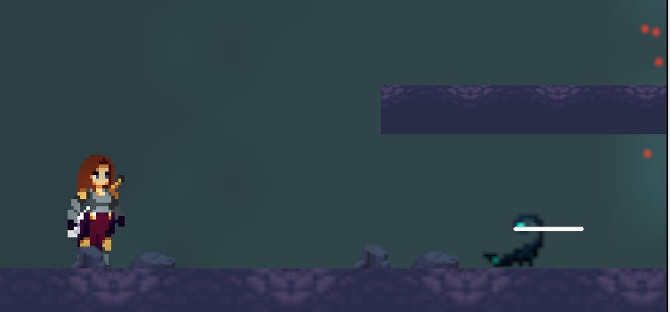
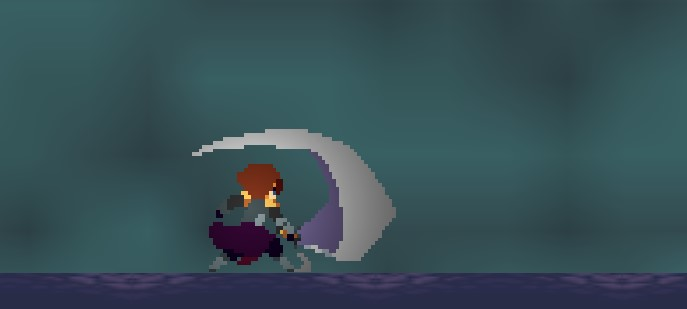
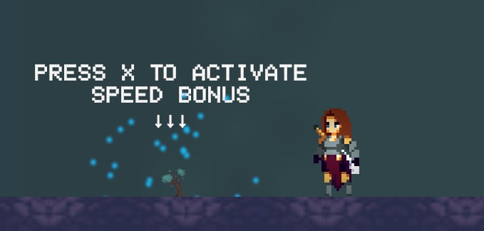
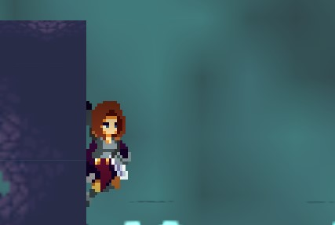

# Pointless Warrior

A small 2D pixel-art playground made in Unity, where you play a mage who runs, dashes and fights with magic and a staff swing.

### [▶ Play it in your browser on itch.io](https://adamkacem.itch.io/pointless-warrior)



## What this is

Pointless Warrior isn't a full game: there are no levels to beat and no real goal. I made it for fun, to experiment with Unity, game logic in C# and animated pixel-art assets. It's a single area where I tried out mechanics one after the other: movement, combat, an enemy, power-ups, camera tricks and lighting.

## Features

- **Movement:** run, jump and dash.
- **Combat:** shoot magic projectiles, swing your staff, or dash into an enemy and swing for a slide attack that knocks it far back.
- **Enemy:** a scorpion that spots you, chases you, takes knockback and has its own health bar.
- **Two buffs to experiment with:** collect a speed potion and a strength potion, and use them when you want. Speed more than doubles your run speed for 5 seconds, strength doubles your damage for 7 seconds, with a timer bar.
- **World:** a camera that moves from room to room, a fountain you break to open the way, a darker cave with different lighting, health pickups and falling leaves.
- **Menu, death screen and restart**, plus on-screen buttons for touch screens.
- **Wall slide and super jump (just for fun):** you can slide down walls and do a big jump off them. I added these only to have fun building the mechanic. You can try them, but the map doesn't need them anywhere.

| Slide attack knockback | The two buffs |
|---|---|
|  |  |

| Wall slide + super jump (experiment) |
|---|
|  |

## Controls

| Key | Action |
|---|---|
| ← → | Move |
| Space | Jump (also off walls) |
| Shift | Dash |
| V | Magic projectile |
| C | Staff swing (during a dash: slide attack) |
| X | Use speed potion |
| N | Use strength potion |
| R | Restart after dying |

## How some of it works

| Script | What's interesting |
|---|---|
| [`MageScript`](Scripts/Player/MageScript.cs) | The player controller: jump, dash, and the knockback when the player gets hurt. Wall sliding uses the direction of the collision (a contact facing left or right means a wall, not the floor). |
| [`ScorpionBlue`](Scripts/Enemy/ScorpionBlue.cs) | The enemy. It casts a ray toward the player every physics step and only chases when the ray actually reaches the player, so it can't see through walls. Each attack type pushes it back with a different force, and damage is multiplied by the player's strength. |
| [`SwingAttack`](Scripts/Player/SwingAttack.cs) | The staff swing. Swinging during a dash turns it into a slide attack with its own hitbox and stronger knockback. Has a cooldown shown with a small timer bar. |
| [`attack`](Scripts/Player/attack.cs) | The magic projectile. Uses a small pool of projectiles that are reused instead of created and destroyed every shot. |
| [`Inventory`](Scripts/Player/Inventory.cs) | Collected potions, the timed speed and strength buffs, their particles and the HUD counters. |
| [`Door`](Scripts/World/Door.cs) + [`CameraController`](Scripts/Camera/CameraController.cs) | The camera either follows the player or locks onto the current room. Walking through a door tells the camera which room to move to and how much to zoom. [`zoom`](Scripts/Camera/zoom.cs) does a smooth zoom on the player at the end. |

## About this repository

This repo has the game's **C# scripts** only, sorted by role:

```
Scripts/
    Player/   movement, attacks, health, buffs
    Enemy/    scorpion AI and health
    World/    doors, fountain, pickups, leaves, cave lighting
    Camera/   room camera, follow mode, end zoom
    UI/       menu, restart, touch buttons
```

The full Unity project isn't included because almost all of the art comes from third-party asset packs (listed below) whose licenses don't allow sharing the files. To see the game, [play it on itch.io](https://adamkacem.itch.io/pointless-warrior).

Made with Unity 2022.3 (2D, Universal Render Pipeline, TextMeshPro).

## Credits

Art and effects from these asset packs (not included in this repo):

- [Platformer Tileset - Pixelart Grasslands](https://biggermanjd.itch.io/platformer-tileset-pixelart-grasslands) by BiggerManJD
- [2D Platform Tile Set - Cave](https://assetstore.unity.com/packages/2d/environments/2d-platfrom-tile-set-cave-61672) (cave tiles and the scorpion)
- [Pixel FX Vol1 - Fire & Smoke](https://assetstore.unity.com/packages/2d/pixel-fx-vol1-fire-smoke-301082) by AoiSani
- [Warrior Free Asset](https://assetstore.unity.com/packages/2d/characters/warrior-free-asset-195707)
- [Dark Platformer Set1](https://assetstore.unity.com/packages/2d/environments/dark-platformer-set1-165307)
